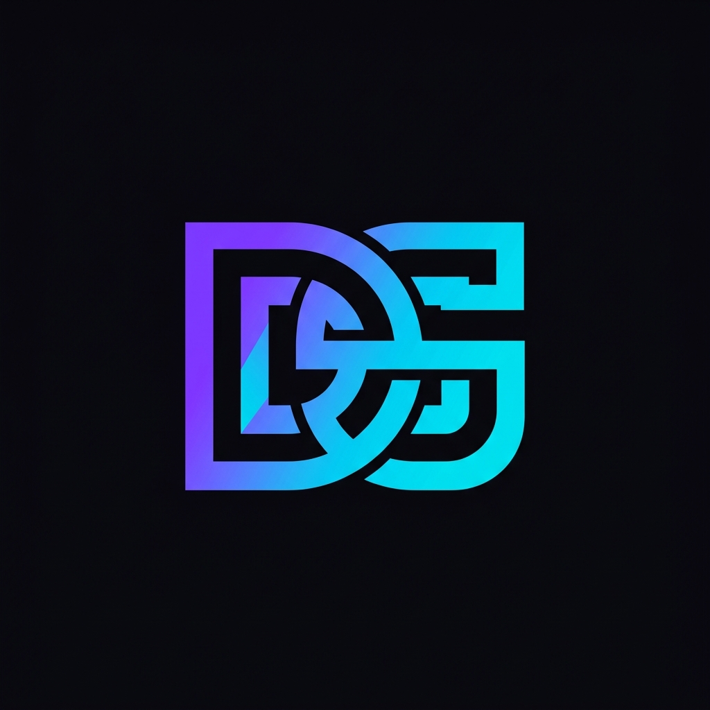

# DS Web Solution 🚀

Sitio web profesional para **DS Web Solution** — Servicios de desarrollo web de alto impacto.



## ✨ Características

- 🎨 **Diseño Premium** — Tema oscuro con glassmorphism, gradientes animados y micro-animaciones
- 🌐 **Bilingüe** — Soporte completo para español e inglés con cambio dinámico
- 📱 **Responsive** — Diseño adaptable para todos los dispositivos
- ⚡ **Rendimiento** — HTML, CSS y JS vanilla sin dependencias pesadas
- 🔍 **SEO Optimizado** — Meta tags, estructura semántica y buenas prácticas

## 🛠️ Servicios Ofrecidos

- Landing Pages
- Tiendas Online (E-commerce)
- Sitios Web Corporativos
- Aplicaciones Web (PWA)
- Diseño UI/UX
- Mantenimiento Web
- Desarrollo WordPress

## 📂 Estructura del Proyecto

```
ds-web-solution/
├── index.html          # Página principal
├── css/
│   └── styles.css      # Estilos y sistema de diseño
├── js/
│   └── main.js         # Interactividad y animaciones
├── assets/
│   └── images/         # Imágenes y logo
├── .gitignore
└── README.md
```

## 🚀 Cómo Usar

1. Clona el repositorio:
   ```bash
   git clone https://github.com/davidsangarita-hash/ds-web-solution.git
   ```

2. Abre `index.html` en tu navegador o usa un servidor local:
   ```bash
   npx serve .
   ```

## 🎨 Tecnologías

- **HTML5** — Estructura semántica
- **CSS3** — Variables CSS, Grid, Flexbox, animaciones
- **JavaScript** — ES6+, Intersection Observer, localStorage
- **Fuentes** — Space Grotesk + Inter (Google Fonts)
- **Iconos** — Remix Icon

## 📄 Licencia

© 2026 DS Web Solution. Todos los derechos reservados.
